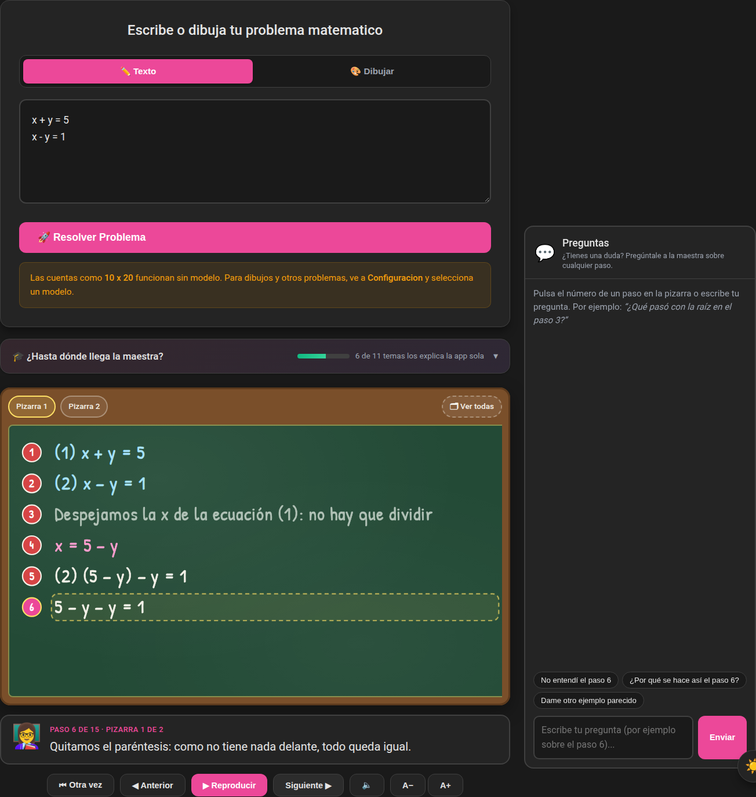
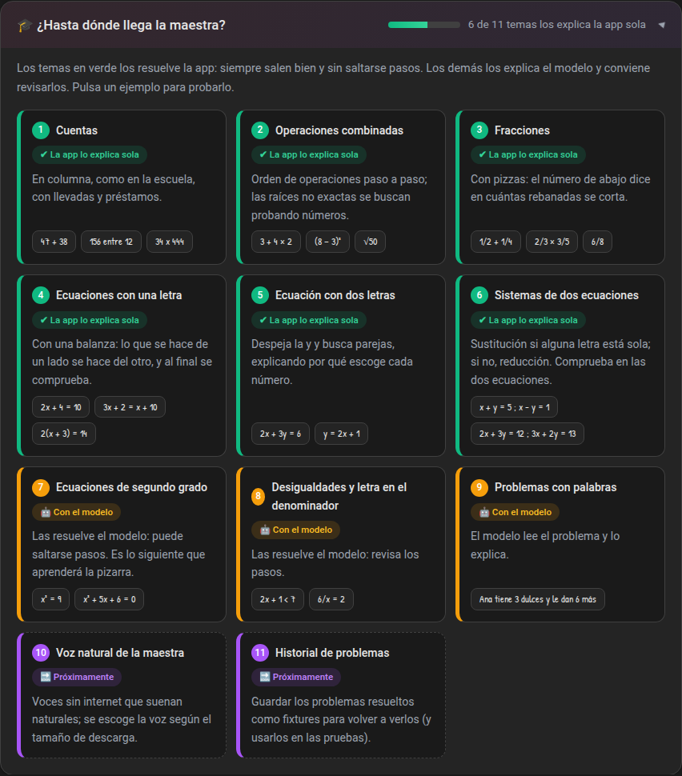
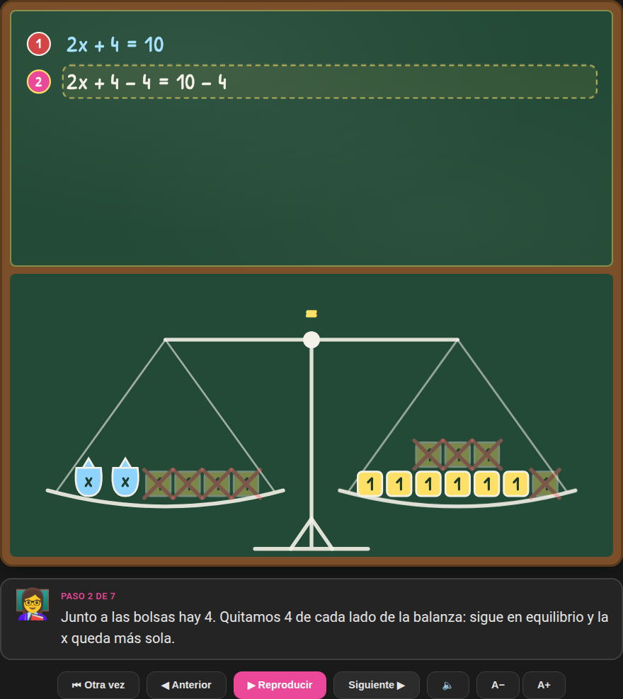
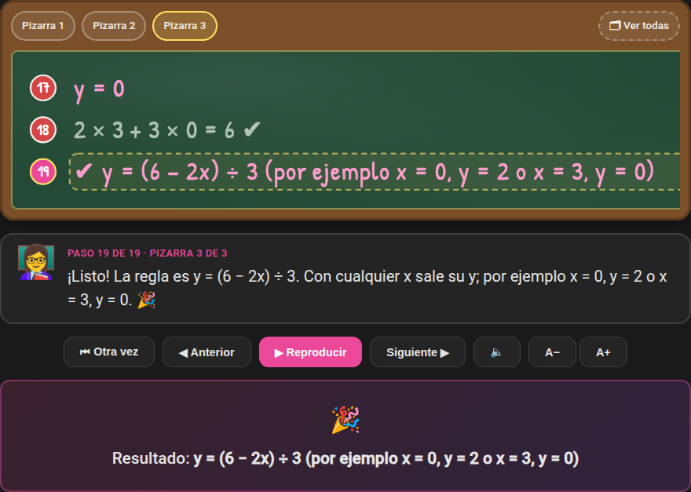
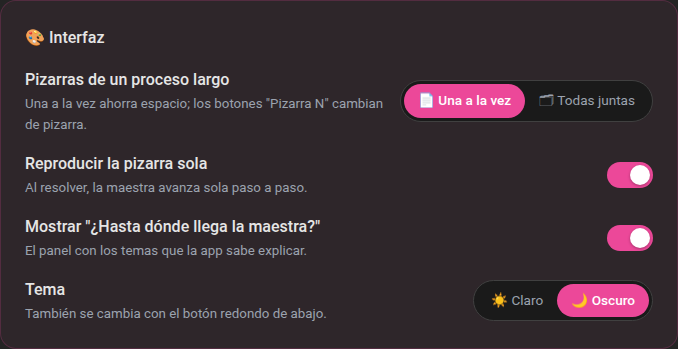

[Español](README.md) | [English](README.en.md)

# Matemáticas Teacher

Aplicación de escritorio (Tauri v2 + React/TypeScript) que enseña a niños a resolver problemas de matemáticas paso a paso en una pizarra animada, con balanza, pizzas y un chat para preguntar sobre cada paso. La inteligencia artificial corre **dentro de la app**, sin internet y sin servidores: los modelos se descargan una vez y se usan en la propia computadora.



## Características

- **Pizarra animada** con explicaciones paso a paso y pasos numerados.
- **Resolución simbólica propia** (sin modelo): cuentas, orden de operaciones, raíces de cualquier índice, fracciones, ecuaciones de primer grado, ecuaciones con dos letras y sistemas de dos ecuaciones — en `src/lib/board/`.
- **Panel "¿Hasta dónde llega la maestra?"**: muestra qué temas explica la app sola, cuáles van al modelo y qué viene después.
- **Pizarras de una en una**: los procesos largos se reparten en varias pizarras y se ve una a la vez (o todas juntas, si se pide).
- **Visuales**: balanza para ecuaciones, pizzas y rectángulos para fracciones.
- **Chat de preguntas** sobre cada paso (`StepChat`).
- **Lienzo de dibujo**: lee lo que el niño escribe/dibuja con modelos con visión (mtmd) y permite corregirlo.
- **IA local con llama.cpp** integrado en la app (como Handy con whisper): sin servidor ni puertos; backends CPU/CUDA/Vulkan se cargan en tiempo de ejecución según el hardware.
- **Gestor de modelos** (Llama, Qwen, Phi, Gemma, Mistral): descarga desde HuggingFace, selección del modelo activo y eliminación.
- **Instaladores** `.deb` y AppImage (versiones con GPU NVIDIA y solo CPU) en `instaladores/`.

## Qué sabe explicar

La app resuelve **por su cuenta** (sin modelo, siempre correcto y sin saltarse pasos) hasta **sistemas de dos
ecuaciones de primer grado**. Lo que pasa de ahí lo explica el modelo local, y conviene revisar los pasos.
La misma lista aparece dentro de la app en el panel *¿Hasta dónde llega la maestra?*
(`src/lib/capabilities.ts`); al agregar un tema nuevo se actualizan los dos lugares.

| # | Tema | Ejemplos | Cómo lo explica | Quién lo resuelve |
|---|---|---|---|---|
| 1 | Cuentas | `47 + 38`, `156 entre 12`, `34 x 444` | En columna, con llevadas y préstamos | ✔ La app |
| 2 | Operaciones combinadas | `3 + 4 × 2`, `(8 − 3)²`, `√50` | Orden de operaciones; raíces no exactas por tanteo | ✔ La app |
| 3 | Fracciones | `1/2 + 1/4`, `2/3 × 3/5`, `6/8` | Con pizzas | ✔ La app |
| 4 | Ecuaciones con una letra | `2x + 4 = 10`, `2(x + 3) = 14` | Con una balanza y comprobación | ✔ La app |
| 5 | Ecuación con dos letras | `2x + 3y = 6` | Despeja la y y busca parejas, explicando por qué escoge cada número | ✔ La app |
| 6 | Sistemas de dos ecuaciones | `x + y = 5` y `x − y = 1` (una por renglón) | Sustitución si alguna letra está sola; si no, reducción | ✔ La app |
| 7 | Ecuaciones de segundo grado | `x² = 9`, `x² + 5x + 6 = 0` | — | 🤖 Modelo |
| 8 | Desigualdades, letra en el denominador | `2x + 1 < 7`, `6/x = 2` | — | 🤖 Modelo |
| 9 | Problemas con palabras | "Ana tiene 3 dulces…" | — | 🤖 Modelo |

Los sistemas se escriben con una ecuación por renglón (también sirven `;` o `, `).

## Capturas

| | |
|---|---|
|  |  |
| **¿Hasta dónde llega la maestra?** Los ejemplos se escriben en el cuadro al pulsarlos. | **Ecuación con una letra**: la balanza muestra lo que se quita de cada lado. |
|  |  |
| **Pizarras de una en una**: los botones *Pizarra N* cambian de pizarra y *Ver todas* las junta. | **Configuración › Interfaz**: pizarras, reproducción automática, panel de temas y tema. |

Las capturas se generan con `npm run capturas` (Playwright con el backend simulado de los e2e) y se guardan en
`docs/capturas/`.

## Configuración de la interfaz

En **⚙️ Configuración › 🎨 Interfaz** (se guarda en el equipo):

- **Pizarras de un proceso largo**: *Una a la vez* (por defecto, ahorra espacio) o *Todas juntas*. En la pizarra,
  el botón *Ver todas* / *Una a la vez* cambia solo ese problema.
- **Tamaño de letra** de la pizarra y de la explicación: chica, normal, grande o muy grande. También se cambia con
  los botones **A−** / **A+** junto a la pizarra. La letra no se encoge cuando un renglón es largo: si no cabe, la
  pizarra se desplaza de lado.
- **Reproducir la pizarra sola** al resolver.
- **Mostrar "¿Hasta dónde llega la maestra?"** en la pantalla principal.
- **Tema** claro u oscuro.

## Próximamente

- **Ecuaciones de segundo grado** en la pizarra (primero `x² = 9`, después factorización y fórmula general).
- **Voz natural de la maestra** (sin internet): voces neuronales locales en lugar de la voz robótica del sistema. El
  usuario escogerá la voz según el tamaño: Piper (~60 MB, rápida en CPU) o Kokoro (~300 MB, más expresiva). Incluirá
  leer bien las matemáticas ("2x + 3y = 6" → "dos equis más tres ye igual a seis") y avanzar la pizarra al
  terminar cada audio.
- **Historial de problemas guardado como fixture**: cada problema resuelto se guardará como un archivo (el texto
  y el guion de la pizarra) para volver a verlo después sin resolverlo de nuevo. Esos mismos archivos servirán como
  fixtures en las pruebas, para comprobar que una explicación no cambia sin querer.

## Requisitos

| | Mínimo | Recomendado |
|---|---|---|
| Sistema | Linux x86_64 (probado en Ubuntu 24.04) | — |
| RAM | 8 GB | 16 GB o más |
| Disco | 5 GB libres (app + un modelo pequeño) | 20 GB (varios modelos) |
| GPU | No hace falta: funciona en CPU | NVIDIA con 8 GB de VRAM o más |

Sin GPU funciona igual, solo más lento (~15 s por explicación con un modelo de 2–3B). Con GPU NVIDIA la detecta sola al arrancar.

## Instalación

### Desde el instalador (lo más rápido)

Descarga el instalador (`.deb` o AppImage) de la página de *Releases* o de [`instaladores/`](instaladores/):

| Versión | Funciona en | Usa la GPU | Tamaño (.deb / AppImage) |
|---|---|---|---|
| **con-GPU-NVIDIA** | Cualquier PC | Sí, si hay NVIDIA con driver | ~520 MB / ~590 MB |
| **solo-CPU** | Cualquier PC | Nunca | ~20 MB / ~100 MB |

```bash
# Ubuntu / Debian
sudo apt install ./matematicas-teacher_0.1.0_amd64_con-GPU-NVIDIA.deb

# Cualquier Linux (sin instalar)
chmod +x matematicas-teacher_0.1.0_amd64_con-GPU-NVIDIA.AppImage
./matematicas-teacher_0.1.0_amd64_con-GPU-NVIDIA.AppImage
```

- La versión con GPU también funciona en PCs sin GPU: si no detecta una NVIDIA, usa la CPU.
- El `.deb` instala el programa en `/usr/bin/matematicas-teacher` y aparece en el menú como **Matemáticas Teacher**.
- Ninguna versión incluye modelos: se descargan desde la app.

### Compilar desde el código

1. **Paquetes del sistema** (Ubuntu / Debian):

   ```bash
   sudo apt update
   sudo apt install -y build-essential curl wget file pkg-config cmake clang libclang-dev \
     libwebkit2gtk-4.1-dev libssl-dev libxdo-dev libayatana-appindicator3-dev librsvg2-dev \
     patchelf libfuse2t64
   ```

2. **Rust** (rustup) y **Node.js 20 o superior**.

3. **CUDA** (opcional, solo con GPU NVIDIA): por defecto la app se compila con soporte CUDA, que
   requiere el CUDA Toolkit. Sin GPU, compila sin CUDA:
   `npm run tauri -- build -- --no-default-features --features custom-protocol`.

4. **Clonar y ejecutar**:

   ```bash
   git clone <url-del-repositorio> matematicas_teacher
   cd matematicas_teacher
   npm install
   npm run tauri dev
   ```

   La primera compilación tarda bastante (compila llama.cpp y, con CUDA, sus kernels: 10–30 min;
   sin CUDA, unos minutos). Las siguientes tardan segundos.

### Primer uso

1. Entra en **⚙️ Configuración** y descarga un modelo de la lista (todos leen dibujos).
2. Pulsa **Select**: pasa a *Active Model* y se carga en memoria.
3. Escribe o dibuja un problema en la pizarra.

### Dónde se guardan los datos

| Qué | Dónde |
|---|---|
| Modelos descargados | `~/.local/share/com.matematicas.teacher/models/` |
| Configuración | `~/.local/share/com.matematicas.teacher/settings.json` |

La app también encuentra modelos ya descargados en la caché de HuggingFace (`~/.cache/huggingface/hub`).

Guía completa (requisitos, problemas comunes, GitHub Actions): [docs/INSTALACION.md](docs/INSTALACION.md).

## Desarrollo

```bash
npm install
npm run tauri:dev     # app completa (frontend + backend Rust)
npm run dev           # solo el frontend (Vite, http://localhost:5173)
```

## Scripts

| Comando | Descripción |
|---|---|
| `npm run dev` | Frontend con Vite |
| `npm run build` | `tsc` + `vite build` |
| `npm run test` | Tests unitarios (Vitest) |
| `npm run test:run` | Tests unitarios una vez |
| `npm run test:e2e` | Tests E2E (Playwright) |
| `npm run capturas` | Capturas de la interfaz para el README (`docs/capturas/`) |
| `npm run icono` | Genera todos los íconos (PNG, .ico, .icns y favicon) desde `src-tauri/icons/icon.svg` |
| `npm run tauri:dev` | App Tauri en modo desarrollo |
| `npm run tauri:build` | Compilar la app |
| `npm run package:gpu` | Generar instaladores (.deb/AppImage) con backends GPU |
| `npm run package:cpu` | Generar instaladores solo CPU |

## Estructura

```
src/                  Frontend React (Vite + TypeScript)
  lib/board/          Solver simbólico: racional, fracciones, ecuaciones, dos letras, sistemas, expresiones
  lib/capabilities.ts Temas que explica la app (panel "¿Hasta dónde llega la maestra?")
  lib/uiPrefs.ts      Preferencias de la interfaz
  components/         Chalkboard, BoardVisual, LevelsPanel, UiPrefsSection, DrawingCanvas, StepChat, ModelBrowser
  pages/              MainApp, Settings
src-tauri/            Backend Rust (Tauri v2)
  src/ai/             Motor de IA (llama.cpp, visión mtmd)
  src/models/         ModelManager: descarga/Selección/eliminación desde HuggingFace
scripts/              Empaquetado de librerías GPU/CPU y bundles; capturas/ genera las capturas
e2e/                  Tests Playwright
docs/INSTALACION.md   Guía de instalación y compilación
docs/capturas/        Capturas de la interfaz
BITACORA.md           Bitácora del proyecto
```

## Licencia

LGPL-2.1 — ver [LICENSE](LICENSE).
